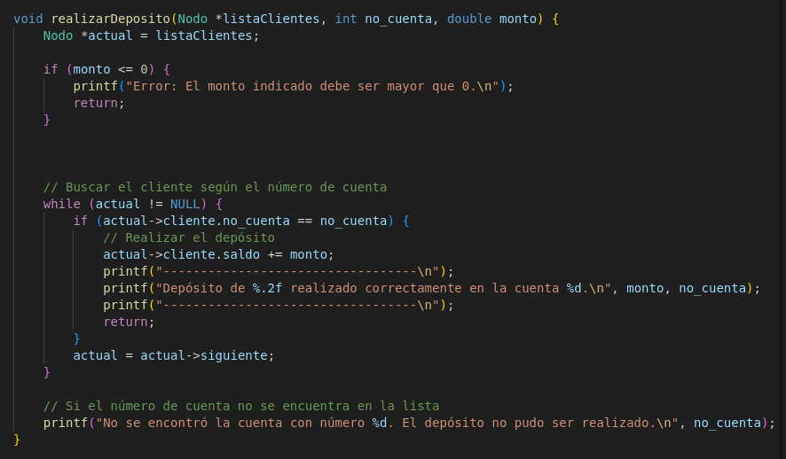

## 202010316 Joseph Jeferson Marroquín Monroy
## 201902128 Jorge Mario Cano Blanco

# Práctica 2

En esta función se agrega un cliente a la lista en memoria utilizando una lista enlazada.

Función que sirve para escribir el reporte de operaciones donde se coloca la fecha y hora en que se está generando, las operaciones realizadas, las operaciones por hilo el total de operaciones y todo esto se escribe en un archivo.

Función para leer el contenido del archivo JSON de usuarios  y almacenar los datos en la lista, donde se valida si el numero de cuenta es un entero positivo y si el numero de cuenta está duplicado.

Función para escribir la lista de clientes en un archivo JSON donde se gener ael archivo estado_cuentas.json

Función para generar el reporte de carga de usuarios donde se coloca la fecha y hora que fue generado, los usuarios cargados, el total de usuarios y lo errores

Funcion que se usa para realizar depositos donde se le envia la listadeclientes en memoria, el numero de cuenta al que se le va depositar y el monto.

Funcion que se usa para realizar retiros donde se le envia la listadeclientes en memoria, el numero de cuenta al que se le va retirar y el monto.

Funcion que se usa para realizar transferencias donde se le envia la listadeclientes en memoria, el numero de cuenta al que se le va depositar, el numero de cuenta al que se le va hacer el retiro y el monto.

Funcion que se usa para realizar consulta de cuenta donde se le envia la listadeclientes en memoria, el numero de cuenta que se necesita ver la información

Funcion que se utilizar para leer el archivo de operaciones con hilos de forma concurrente y después según venga la operación realizarla de forma ordenada.

dependiendo que operación venga en el archivo así será como se ejecutará.

Menú de la aplicación

